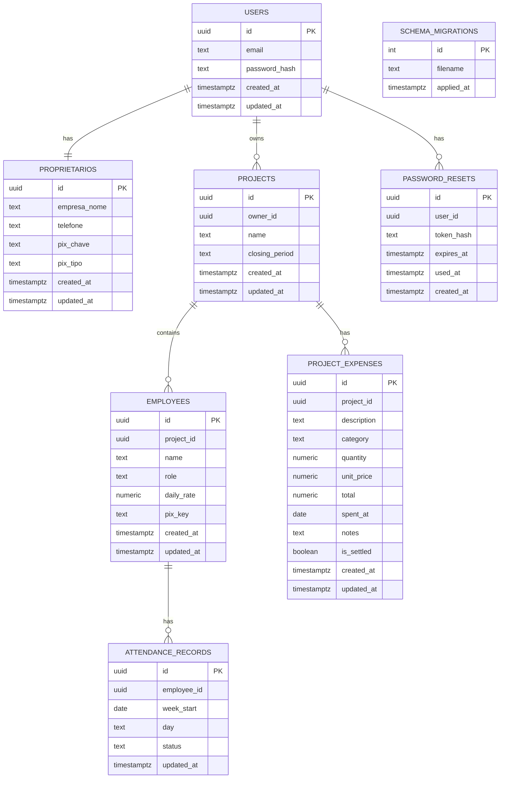

# DER do banco Conserpav

```mermaid
erDiagram
    USERS {
      uuid id PK
      text email
      text password_hash
      timestamptz created_at
      timestamptz updated_at
    }

    PROPRIETARIOS {
      uuid id PK
      text empresa_nome
      text telefone
      text pix_chave
      text pix_tipo
      timestamptz created_at
      timestamptz updated_at
    }

    PROJECTS {
      uuid id PK
      uuid owner_id
      text name
      text closing_period
      timestamptz created_at
      timestamptz updated_at
    }

    EMPLOYEES {
      uuid id PK
      uuid project_id
      text name
      text role
      numeric daily_rate
      text pix_key
      timestamptz created_at
      timestamptz updated_at
    }

    ATTENDANCE_RECORDS {
      uuid id PK
      uuid employee_id
      date week_start
      text day
      text status
      timestamptz updated_at
    }

    PROJECT_EXPENSES {
      uuid id PK
      uuid project_id
      text description
      text category
      numeric quantity
      numeric unit_price
      numeric total
      date spent_at
      text notes
      boolean is_settled
      timestamptz created_at
      timestamptz updated_at
    }

    PASSWORD_RESETS {
      uuid id PK
      uuid user_id
      text token_hash
      timestamptz expires_at
      timestamptz used_at
      timestamptz created_at
    }

    SCHEMA_MIGRATIONS {
      int id PK
      text filename
      timestamptz applied_at
    }

    USERS ||--|| PROPRIETARIOS : has
    USERS ||--o{ PROJECTS : owns
    USERS ||--o{ PASSWORD_RESETS : has
    PROJECTS ||--o{ EMPLOYEES : contains
    PROJECTS ||--o{ PROJECT_EXPENSES : has
    EMPLOYEES ||--o{ ATTENDANCE_RECORDS : has
```
